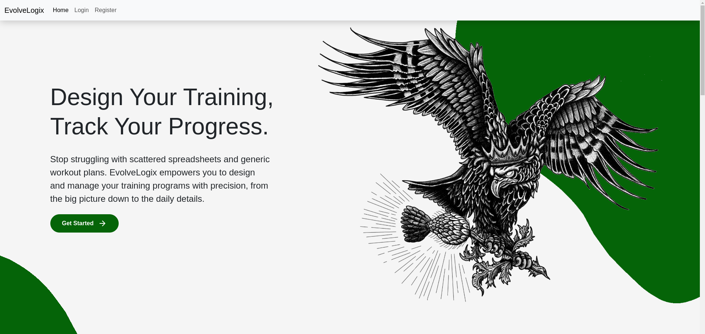
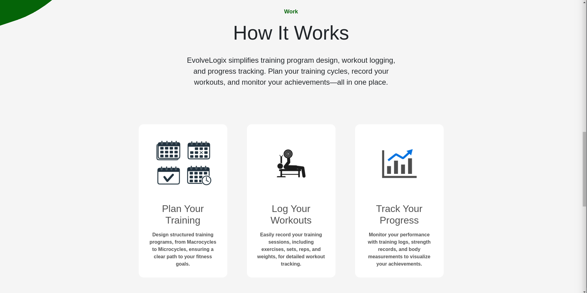
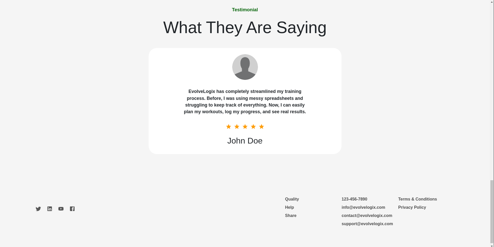
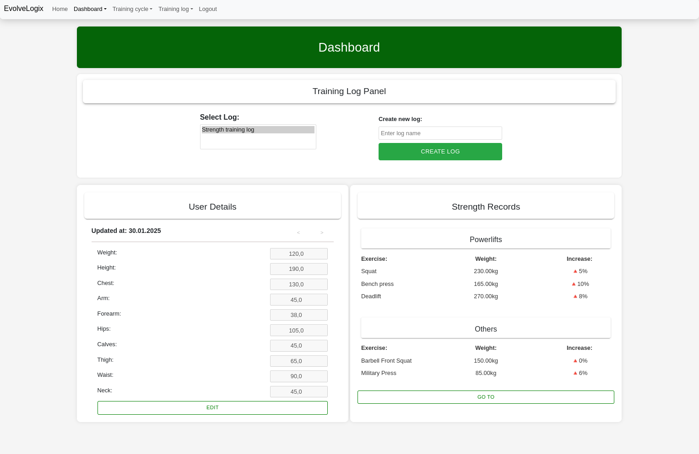

# EvovleLogix

EvolveLogix is a comprehensive web application designed to empower users in managing their fitness journey.
With EvolveLogix, users can effortlessly maintain detailed training logs, including exercises, weights, reps, and sets for each session.
Each exercise is accompanied by key metrics such as exercise volume, average intensity, and total repetitions, providing users with a clear understanding of their performance.
The app also allows users to create and organize complex training plans, starting from macrocycles and mesocycles down to individual phases and training sessions.
Additionally, EvolveLogix provides tools to track personal progress, such as body measurements and strength records, complete with percentage improvements over time.
Whether you're a fitness enthusiast or a professional athlete, EvolveLogix offers a user-friendly interface to log workouts, analyze performance, and achieve your fitness goals.

## Table of Contents

- [Installation](#installation)
- [Usage](#usage)
- [Features](#features)
- [Screenshots](#screenshots)
- [Technologies Used](#technologies-used)
- [Contributing](#contributing)
- [License](#license)
- [Contact](#contact)

## Installation

### Prerequisites

- Docker
- Docker Compose

### Installing Docker

Follow the official Docker installation guide for your operating system:

- [Docker Installation Guide](https://docs.docker.com/get-docker/)

### Installing Docker Compose

Follow the official Docker Compose installation guide:

- [Docker Compose Installation Guide](https://docs.docker.com/compose/install/)

### Running the Application

1. Clone the repository:

   ```sh
   git clone https://github.com/yourusername/evolvelogix.git
   cd EvolveLogix
   ```

2. Run the setup script:

   ```sh
   ./evolve-run.sh
   ```

## Usage

1. Open your browser and navigate to:

```markdown
http://localhost:3000/
```

2. Create an account or log in to access the application.

3. Once logged in, you can start using the application to manage your training logs, view statistics, and set goals.

## Features

- **User Authentication and Authorization**: Securely create accounts, log in, and manage user sessions.
- **Training Logs**: Create and manage detailed training logs, including exercises, weights, reps, and sets for each session.
- **Performance Metrics**: View key metrics such as exercise volume, average intensity, and total repetitions.
- **Training Plans**: Organize complex training plans, starting from macrocycles and mesocycles down to individual phases and training sessions.
- **Progress Tracking**: Track personal progress with tools for body measurements and strength records, complete with percentage improvements over time.

## Screenshots

### Home Page (Top)



### Home Page (Middle)


### Home Page (How it works)



### Home Page (Bottom)



### Login Page


### Dashboard



### Training Cycles


### Phase section


### Microcycle programming


### Training Log Dashboard


### Training Log


## Technologies Used

### Frontend

- **React**: A JavaScript library for building user interfaces.
- **Redux**: A predictable state container for JavaScript apps.
- **Material-UI**: A popular React UI framework.
- **CSS**: Styling for the application.

### Backend

- **Django**: A high-level Python web framework that encourages rapid development and clean, pragmatic design.
- **Simle JWT**: A JSON Web Token authentication plugin for the Django REST Framework.
- **Express**: A minimal and flexible Node.js web application framework.
- **PostgreSQL**: A powerful, open-source object-relational database system.

### DevOps

- **Docker**: A platform for developing, shipping, and running applications in containers.
- **Docker Compose**: A tool for defining and running multi-container Docker applications.

### Other Tools

- **Git**: Version control system for tracking changes in source code.
- **GitHub**: Hosting service for Git repositories.

## License

This project is licensed under the MIT License. See the [LICENSE](LICENSE) file for details.

## Contact

If you have any questions, suggestions, or feedback, feel free to contact me:

- **Author:** Artur Penar
- **Email:** penar.art@gmail.com     
- **GitHub:** [artur-penar](https://github.com/artur-penar/)
- **LinkedIn:** [Artur Penar](https://www.linkedin.com/in/artur-penar-18092a324/)