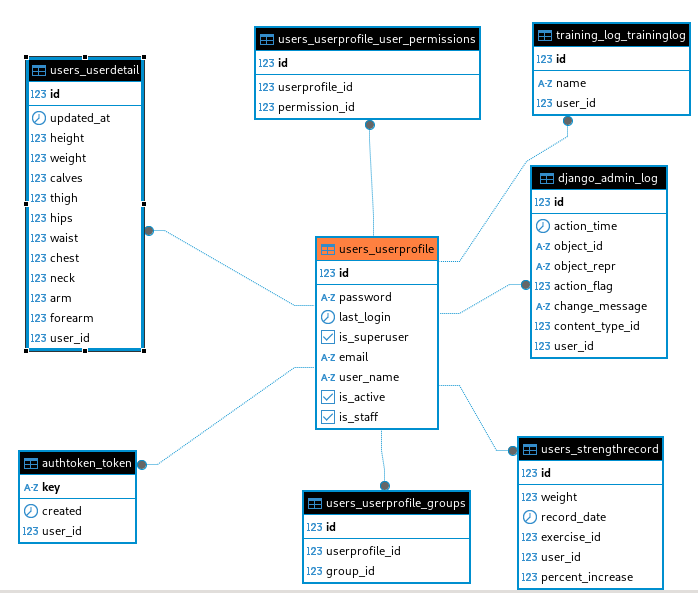
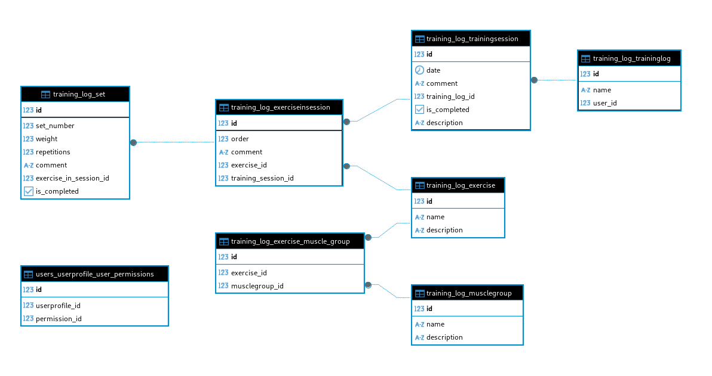
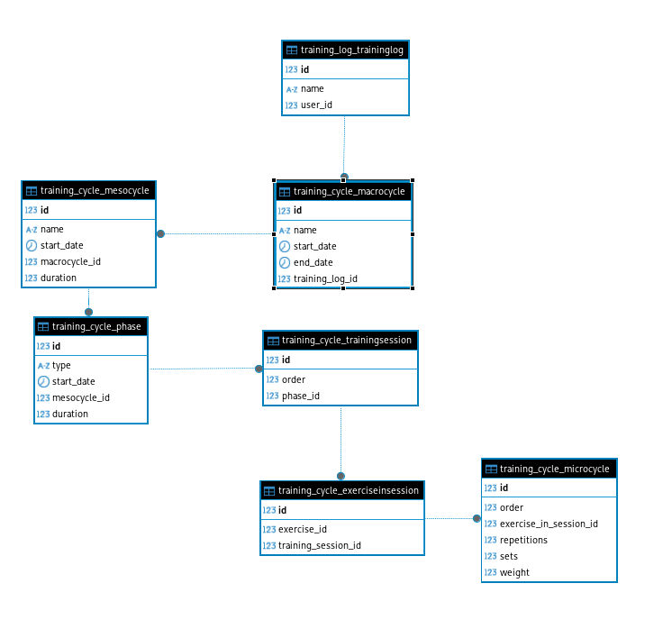

# Data Structure Documentation

## Overview

This document provides an overview of the data structure for the backend of the Django project. It includes detailed descriptions of the models used in the three main applications: `users`, `training_log`, and `training_cycle`. Each section contains information about the models, their fields, methods, and example usage. Additionally, an Entity-Relationship Diagram (ERD) is included to visualize the relationships between the models.

## Users Application

### Models

#### UserProfileManager
- **Description:** Manager for user profiles.
- **Methods:**
  - `create_user(user_name, email, password=None)`: Creates a new user profile.
    - **Parameters:**
      - `user_name`: CharField
      - `email`: EmailField
      - `password`: CharField (optional)
    - **Raises:**
      - `ValueError`: If email is not provided.
  - `create_superuser(email, user_name, password)`: Creates a superuser profile.
    - **Parameters:**
      - `email`: EmailField
      - `user_name`: CharField
      - `password`: CharField

#### UserProfile
- **Description:** Database model for users in the system.
- **Fields:**
  - `email`: EmailField (max_length=155, unique=True)
  - `user_name`: CharField (max_length=155, default="user_name")
  - `is_active`: BooleanField (default=True)
  - `is_staff`: BooleanField (default=False)
- **Methods:**
  - `get_full_name()`: Retrieves the full name of the user.
  - `__str__()`: Retrieves the string representation of the user.

#### UserDetail
- **Description:** Model for storing additional user details.
- **Fields:**
  - `user`: ForeignKey (to settings.AUTH_USER_MODEL, on_delete=models.CASCADE)
  - `updated_at`: DateTimeField (auto_now=True)
  - `height`: DecimalField (max_digits=4, decimal_places=1, default=0.00)
  - `weight`: DecimalField (max_digits=4, decimal_places=1, default=0.00)
  - `calves`: DecimalField (max_digits=4, decimal_places=1, default=0.00)
  - `thigh`: DecimalField (max_digits=4, decimal_places=1, default=0.00)
  - `hips`: DecimalField (max_digits=4, decimal_places=1, default=0.00)
  - `waist`: DecimalField (max_digits=4, decimal_places=1, default=0.00)
  - `chest`: DecimalField (max_digits=4, decimal_places=1, default=0.00)
  - `neck`: DecimalField (max_digits=4, decimal_places=1, default=0.00)
  - `arm`: DecimalField (max_digits=4, decimal_places=1, default=0.00)
  - `forearm`: DecimalField (max_digits=4, decimal_places=1, default=0.00)

#### StrengthRecord
- **Description:** Model for storing strength records of users.
- **Fields:**
  - `user`: ForeignKey (to settings.AUTH_USER_MODEL, on_delete=models.CASCADE)
  - `exercise`: ForeignKey (to Exercise, on_delete=models.CASCADE)
  - `weight`: DecimalField (max_digits=5, decimal_places=2)
  - `record_date`: DateTimeField (auto_now_add=True)
  - `percent_increase`: DecimalField (max_digits=5, decimal_places=2, null=True, blank=True)
- **Methods:**
  - `__str__()`: Retrieves the string representation of the strength record.
  - `save(*args, **kwargs)`: Overrides the save method to calculate the percentage increase in weight.

### Entity-Relationship Diagram



### Example Usage

```python
from users.models import UserProfileManager, UserProfile, UserDetail, StrengthRecord
from training_log.models import Exercise

# Create a new user
user_manager = UserProfileManager()
user = user_manager.create_user(user_name='john_doe', email='john@example.com', password='password123')

# Create a new superuser
superuser = user_manager.create_superuser(email='admin@example.com', user_name='admin', password='adminpass')

# Create a new user detail
user_detail = UserDetail(user=user, height=180.0, weight=75.0)
user_detail.save()

# Create a new strength record
exercise = Exercise.objects.get(name='Bench Press')
strength_record = StrengthRecord(user=user, exercise=exercise, weight=100.0)
strength_record.save()
```

## Training Log Application

### Models

#### MuscleGroup
- **Description:** Model representing a muscle group.
- **Fields:**
  - `name`: CharField (max_length=100)
  - `description`: TextField

#### Exercise
- **Description:** Model representing an exercise.
- **Fields:**
  - `name`: CharField (max_length=100)
  - `description`: TextField
  - `muscle_group`: ManyToManyField (to MuscleGroup)

#### Set
- **Description:** A set performed during an exercise session.
- **Fields:**
  - `set_number`: PositiveIntegerField (default=1)
  - `exercise_in_session`: ForeignKey (to ExerciseInSession, related_name='sets', on_delete=models.CASCADE)
  - `weight`: FloatField
  - `repetitions`: PositiveIntegerField
  - `is_completed`: BooleanField (default=True)
  - `comment`: TextField (blank=True, null=True)
- **Methods:**
  - `save(*args, **kwargs)`: Overrides the save method to set the set number.
  - `__str__()`: Retrieves the string representation of the set.

#### TrainingLog
- **Description:** A model representing a training log for a user.
- **Fields:**
  - `user`: ForeignKey (to settings.AUTH_USER_MODEL, on_delete=models.CASCADE)
  - `name`: CharField (default='Log', max_length=100)
- **Methods:**
  - `__str__()`: Retrieves the string representation of the training log.

#### TrainingSession
- **Description:** A model representing a training session.
- **Fields:**
  - `training_log`: ForeignKey (to TrainingLog, on_delete=models.CASCADE, related_name='training_sessions')
  - `description`: TextField (blank=True, null=True)
  - `date`: DateField
  - `comment`: TextField (blank=True, null=True)
  - `is_completed`: BooleanField (default=False)
- **Methods:**
  - `__str__()`: Retrieves the string representation of the training session.

#### ExerciseInSession
- **Description:** A model representing an exercise performed during a training session.
- **Fields:**
  - `training_session`: ForeignKey (to TrainingSession, on_delete=models.CASCADE, related_name='exercises')
  - `exercise`: ForeignKey (to Exercise, on_delete=models.CASCADE, related_name='exercises_in_session')
  - `order`: PositiveIntegerField (default=1)
  - `comment`: TextField (blank=True, null=True)
- **Methods:**
  - `save(*args, **kwargs)`: Overrides the save method to set the order of the exercise.
  - `__str__()`: Retrieves the string representation of the exercise in session.

### Entity-Relationship Diagram



### Example Usage

```python
from training_log.models import MuscleGroup, Exercise, Set, TrainingLog, TrainingSession, ExerciseInSession

# Create a new muscle group
muscle_group = MuscleGroup(name='Chest', description='Chest muscles')
muscle_group.save()

# Create a new exercise
exercise = Exercise(name='Bench Press', description='A chest exercise')
exercise.save()
exercise.muscle_group.add(muscle_group)

# Create a new training log
training_log = TrainingLog(user=user, name='My Training Log')
training_log.save()

# Create a new training session
training_session = TrainingSession(training_log=training_log, date='2023-10-10')
training_session.save()

# Add an exercise to the training session
exercise_in_session = ExerciseInSession(training_session=training_session, exercise=exercise)
exercise_in_session.save()

# Add a set to the exercise in session
set = Set(exercise_in_session=exercise_in_session, weight=100.0, repetitions=10)
set.save()
```

## Training Cycle Application

### Models

#### Macrocycle
- **Description:** Model representing a macrocycle.
- **Fields:**
  - `training_log`: ForeignKey (to TrainingLog, on_delete=models.CASCADE)
  - `name`: CharField (max_length=200)
  - `start_date`: DateField (null=True, blank=True)
  - `end_date`: DateField (null=True, blank=True)
- **Methods:**
  - `__str__()`: Retrieves the string representation of the macrocycle.

#### Mesocycle
- **Description:** Model representing a mesocycle.
- **Fields:**
  - `macrocycle`: ForeignKey (to Macrocycle, on_delete=models.CASCADE, related_name='mesocycles')
  - `name`: CharField (max_length=200)
  - `start_date`: DateField (null=True, blank=True)
  - `duration`: PositiveIntegerField (null=True, blank=True)
- **Methods:**
  - `end_date()`: Property that calculates the end date of the mesocycle.
  - `save(*args, **kwargs)`: Overrides the save method to validate phase duration and overlap.
  - `validate_phase_duration()`: Validates that the mesocycle duration is not less than the sum of all phases duration.
  - `validate_overlap()`: Validates that mesocycles do not overlap.
  - `__str__()`: Retrieves the string representation of the mesocycle.

#### Phase
- **Description:** Model representing a phase within a mesocycle.
- **Fields:**
  - `mesocycle`: ForeignKey (to Mesocycle, on_delete=models.CASCADE, related_name='phases')
  - `type`: CharField (max_length=200, choices=PHASE_TYPES, default='Hypertrophy')
  - `start_date`: DateField (null=True, blank=True)
  - `duration`: PositiveIntegerField (null=True, blank=True)
- **Methods:**
  - `end_date()`: Property that calculates the end date of the phase.
  - `save(*args, **kwargs)`: Overrides the save method to validate phase duration and start date.
  - `validate_start_date()`: Validates that the start date of the phase is after the end date of the last phase.
  - `__str__()`: Retrieves the string representation of the phase.

#### TrainingSession
- **Description:** A model representing a training session.
- **Fields:**
  - `phase`: ForeignKey (to Phase, on_delete=models.CASCADE, related_name='training_sessions')
  - `order`: PositiveIntegerField (default=1)
- **Methods:**
  - `__str__()`: Retrieves the string representation of the training session.

#### ExerciseInSession
- **Description:** A model representing an exercise performed during a training session.
- **Fields:**
  - `training_session`: ForeignKey (to TrainingSession, on_delete=models.CASCADE, related_name='exercises')
  - `exercise`: ForeignKey (to Exercise, on_delete=models.CASCADE)
- **Methods:**
  - `__str__()`: Retrieves the string representation of the exercise in session.

#### Microcycle
- **Description:** Model representing a microcycle within an exercise session.
- **Fields:**
  - `exercise_in_session`: ForeignKey (to ExerciseInSession, on_delete=models.CASCADE, related_name='microcycles')
  - `order`: PositiveIntegerField (default=1)
  - `weight`: FloatField (null=True, blank=True)
  - `repetitions`: PositiveIntegerField (null=True, blank=True)
  - `sets`: PositiveIntegerField (null=True, blank=True)
- **Methods:**
  - `__str__()`: Retrieves the string representation of the microcycle.

### Entity-Relationship Diagram



### Example Usage

```python
from training_cycle.models import Macrocycle, Mesocycle, Phase, TrainingSession, ExerciseInSession, Microcycle
from training_log.models import TrainingLog, Exercise

# Create a new macrocycle
training_log = TrainingLog.objects.get(name='My Training Log')
macrocycle = Macrocycle(training_log=training_log, name='Macrocycle 1')
macrocycle.save()

# Create a new mesocycle
mesocycle = Mesocycle(macrocycle=macrocycle, name='Mesocycle 1', duration=12)
mesocycle.save()

# Create a new phase
phase = Phase(mesocycle=mesocycle, type='Strength', duration=4)
phase.save()

# Create a new training session
training_session = TrainingSession(phase=phase, order=1)
training_session.save()

# Add an exercise to the training session
exercise = Exercise.objects.get(name='Bench Press')
exercise_in_session = ExerciseInSession(training_session=training_session, exercise=exercise)
exercise_in_session.save()

# Add a microcycle to the exercise in session
microcycle = Microcycle(exercise_in_session=exercise_in_session, order=1, weight=100.0, repetitions=10, sets=3)
microcycle.save()
```